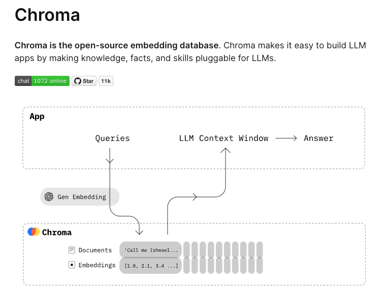

### LLMs and RAGs

Recent Generative AI LLM models are becoming increasingly well suited to extracting patterns from lengthy legal documents. The documents are broken down into small chunks (tokens) and then mapped into multidimensional vector space (embeddings). After that one can search for new queries that are similar to the original embeddings (semantic search).

However, training an LLM from scratch is expensive and time consuming. To address this issue, practitioners use Retrieval Augmented Generation where new information can be joined into a query alongside prompt instructions. The result is a harmonious QA experience.

<figure>
  
  <figcaption>Image Credit: <a href="https://web.stanford.edu/~cgpotts/">Image Credit: Dr. Christopher Potts, Stanford CS224u</a></figcaption>
</figure>

The RateRover QA bot uses OpenAI [ChatGPT](https://openai.com/chatgpt) 3.5-turbo as its LLM and [chromdb](https://docs.trychroma.com/) as its vector database. The vector database is where we store embeddings.

<figure>
  
  <figcaption>Image Credit: <a href="https://docs.trychroma.com/">Image Credit: ChromaDB</a></figcaption>
</figure>