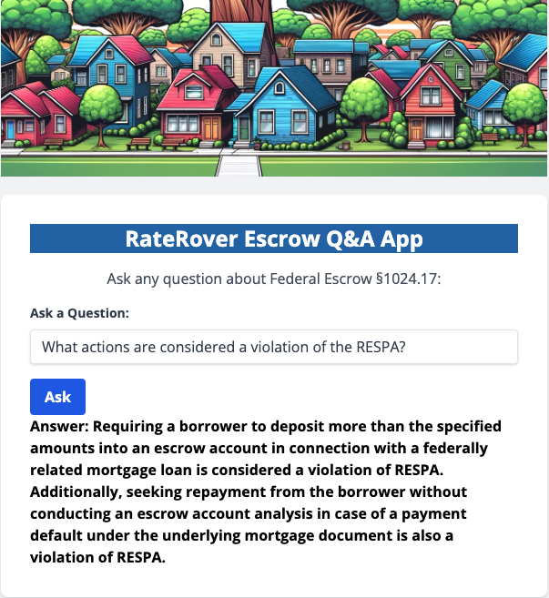
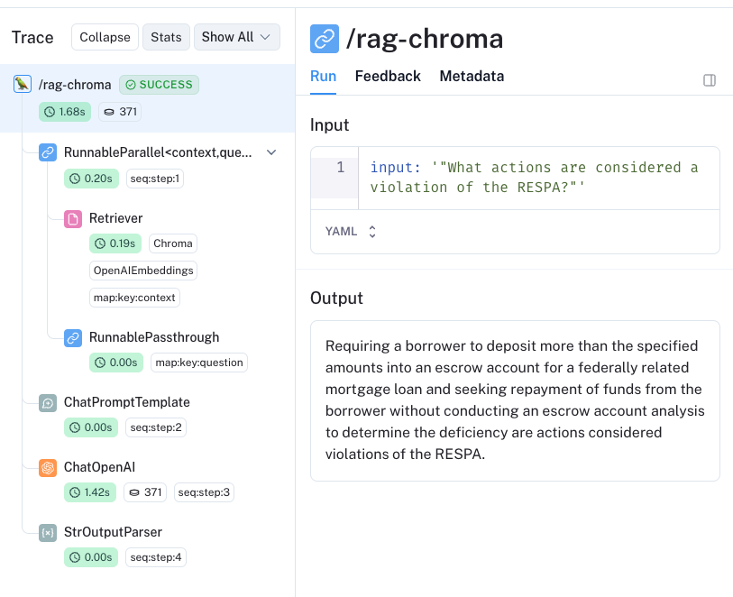

# raterover

<!--  -->

The introduction of a mortgage escrow bot with real-time access to federal escrow statutes is useful because it converges legal compliance, risk management, operational efficiency, and enhanced client service into a single, accessible tool. Escrow matters can be complex and such an app addresses and alleviates some of that complexity.

### Real-time Legislative Compliance and Risk Management

- **Automated Compliance Updates:**
    - The escrow bot can provide instantaneous updates on changes to federal escrow laws, ensuring that all transactions are compliant with the latest regulations.
- **Risk Assessment Tools:**
    - By integrating real-time legislative data, the bot can assess the risk levels of various escrow arrangements under current laws, offering advice on the safest and most compliant pathways forward. Protects clients and brokers from unforeseen legal pitfalls.

<table>
  <tr>
    <td></td>
    <td></td>
  </tr>
</table>

The introduction of a mortgage escrow bot with real-time access to federal escrow statutes is useful because it converges legal compliance, risk management, operational efficiency, and enhanced client service into a single, accessible tool. Escrow matters can be complex and such an app addresses and alleviates some of that complexity.

## **For Brokers:**

1. **Efficiency and Client Service**: Brokers could leverage the bot to quickly access escrow account statuses, payment schedules, and any potential issues, allowing them to manage multiple transactions more effectively.
2. **Compliance**: The bot could ensure that brokers remain compliant with federal regulations such as RESPA by automating escrow analysis and maintaining accurate records.

## **For Clients:**

1. **Transparency**: Clients gain real-time information about their escrow accounts, demystifying the process and enabling them to track their funds throughout the transaction.
2. **Convenience**: The bot could answer common questions about escrow, property taxes, and insurance payments, reducing the need for clients to contact their brokers for basic information.

